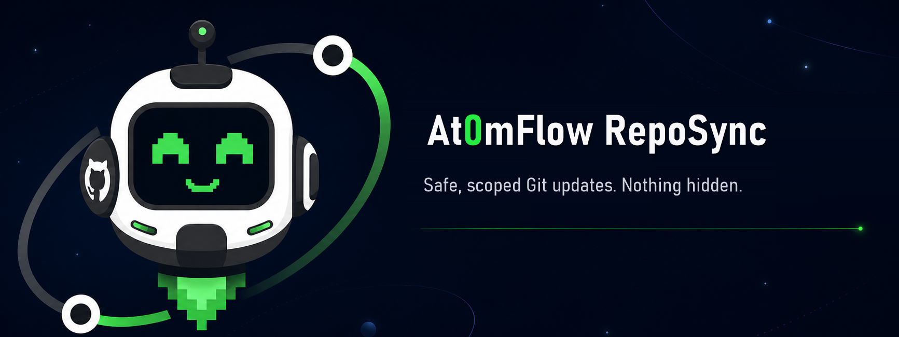

<p align="center">
  
</p>

<p align="center">
  <a href="https://github.com/At0mFlow/At0mFlow-RepoSync/actions/workflows/test.yml"></a>
  <a href="LICENSE"></a>
  <a href="requirements.md"></a>
  <a href="https://at0mflow.com/"></a>
</p>

# At0mFlow RepoSync

RepoSync is a small PowerShell wrapper for making safe, path-scoped commits in
an existing Git working tree. It is useful for operational folders that are
updated by scheduled jobs, including reports, logs, configuration exports and
reviewed script collections.

It does not run `git add .`. You must name every approved repository-relative
path. Unrelated staged changes stay outside the RepoSync commit.

RepoSync never initialises Git, creates a remote, stores credentials, scans
outside the requested paths, uploads to At0mFlow or sends telemetry.

## Quick start

Preview the exact scope first:

```powershell
./src/Invoke-At0mFlowRepoSync.ps1 `
    -RepositoryPath D:\PrivateGit\Operations `
    -IncludePath scripts, manifests `
    -Preview
```

Commit the same scope:

```powershell
./src/Invoke-At0mFlowRepoSync.ps1 `
    -RepositoryPath D:\PrivateGit\Operations `
    -IncludePath scripts, manifests
```

Push to the already configured upstream:

```powershell
./src/Invoke-At0mFlowRepoSync.ps1 `
    -RepositoryPath D:\PrivateGit\Operations `
    -IncludePath scripts, manifests `
    -Push `
    -Quiet
```

## What it protects

- Absolute paths and `..` traversal are rejected.
- `.git` is always out of scope.
- Reparse points are rejected.
- Missing paths must match an existing tracked path, which safely supports
  deletions without accepting a typo.
- Git prompts are disabled during the run.
- Long Windows paths are enabled per command without changing global Git
  configuration.
- `git commit --only` keeps unrelated staged work out of the RepoSync commit.
- Push requires an existing upstream and is never implied by a commit.

## Console branding

Interactive runs open with Orbit above the At0mFlow wordmark. JSON and quiet
runs stay machine-readable.

+```text
==================================================================================================

                                                  @@@@@@
                                                 @@=::=%@
                                                 @@=--=%@
                                                  @@@@@@
                                                    @@@@
                                                  @@@@@@@
                                        @@@@@@@@@@@@@@@@@@@@@@@@@@
                                    @@@@###**+==*#************##+*#@@
                                 @@@=:::.........=##************#:.::%@@
                               @%*:.................=************:.....-%@
                             @@*-...........::::::::::::::::::::::::::::.+#@
                            @#:.........:---:..........................:--:=@@
                           @%#.........-:....+#########################*..:+@@
                          @@=........:-...-%%@@@@@@@@@@@@@@@@@@@@@@@@@@@#=..=%@
                          @@+----:...:-.=#@@@@@@@@@@@@@@@@@@@@@@@@@@@@@@@@#+.=%@
                         @@%####+--..:-.=%@@@@@@@@@@@@@@@@@@@@@@@@@@@@@@@@%+.-%@
                        @@@%%%%##*=-::-.=%@@@@@@%+--*%@@@@@@@@@@%=--%@@@@@%+.-%@
                        @@@@@@@@%##+::-.=%@@@@@*=----=#%@@@@@@%*-----+#@@@%+.-%@
                      @@#+++-...*%#*-:-.=%@@@@@-------=%@@@@@@#-------+@@@%+.-%@@@
                   @@%#******+:..-##-:-.=%@@@@@=--==---#@@@@@@#--===--+@@@%+.-##+#%@
                  @%#**#####***=:.:@*=-.=%@@@@@=-*@@+-=%@@@@@@#--#@@--+@@@%+.-#%*.*@
                  @%###=...+%#***=..*#-.=%@@@@@@@@@@@@@@@@@@@@@@@@@@@@@@@@%+.-%%*:.=@
             @@@@@##+.-+%%*--:=#*=..*#-.=%@@@@@@@@@@@@@%%@@@@%%@@@@@@@@@@@%+.-%%#*-=@@@@
        @@@@@#--=+##+:%%%%%+#-=#*=..*#-.=%@@@@@@@@@@@@@%*====#%@@@@@@@@@@@%+.-%%#*-=@++#@@@@
    @@@@+.......:=##+:%%%%+-#-=#*=..*#-.=%@@@@@@@@@@@@@@@@@@@@@@@@@@@@@@@@%+.-%@#*-=@......*@@@@
  @@+-......-----=##+:#+*+=#%-=#*=..*#-:.:=%@@@@@@@@@@@@@@@@@@@@@@@@@@@@%+:.:-%%#*-=@------:..:+%@
  @@*=::-::=******##*=-#++#%==*#*+::*#----.:+##########################*:.----%%#*=+@=-+***=-:-+%@
    @@@@@@@@@@@@@@%##*:-#%#-:*##++-=#*-----..............................-----#%*--+@@@@@@@@@@@@@
                  @%###+:.:*####=-=@*=----------------+++++++++--------------*%%*-#@@
                   @%##########=-+%%=---------------+***********=-----------=%%##%@@
                    @@%%#####*--=*%###*+======-----*#***********#*---=====+*@%#%@@
                      @@%%%%%###%%############*==-=*************#*-=*######%@@@@@
                          @@@@@%%%%####=-----+#####%%###########%%###=--=*@@
                             @@@@%%%%%#############%%#########%@%########@@
                               @@@@@@@%%%%%%%%%%%%@%%%%%%%%%%%@%%%%%%%%@@
                                  @@@@@@@@@@@@@@@@@@@@@@@@@@@@@@@@@@@@@
                                      @@@@===*@@%%%%%%%%%%%*===#@@@
                                          ----::+*********----==
                                          ==--:::::::::::::-====
                                           -----:::::::::---===
                                            -===-::::::::======
                                             +==---::::--===
                                             ====--:::-=====
                                                -------==
                                                -==--====
                                                  =====

       █████╗ ████████╗ ██████╗ ███╗   ███╗███████╗██╗      ██████╗ ██╗    ██╗
      ██╔══██╗╚══██╔══╝██╔═████╗████╗ ████║██╔════╝██║     ██╔═══██╗██║    ██║
      ███████║   ██║   ██║██╔██║██╔████╔██║█████╗  ██║     ██║   ██║██║ █╗ ██║
      ██╔══██║   ██║   ████╔╝██║██║╚██╔╝██║██╔══╝  ██║     ██║   ██║██║███╗██║
      ██║  ██║   ██║   ╚██████╔╝██║ ╚═╝ ██║██║     ███████╗╚██████╔╝╚███╔███╔╝
      ╚═╝  ╚═╝   ╚═╝    ╚═════╝ ╚═╝     ╚═╝╚═╝     ╚══════╝ ╚═════╝  ╚══╝╚══╝

                     PowerShell clarity.
                      Orbit-level control.

                   ANALYSE | CLEAN | MIGRATE | MONITOR

                         https://at0mflow.com

==================================================================================================
```

## Hourly scheduling

Run the preview and first push interactively under the same identity that will
own the scheduled task. Then schedule the tested command hourly with Task
Scheduler, SCCM or another approved job runner. Configure overlapping runs to
be skipped rather than started in parallel.

See [hourly scheduling](docs/scheduling.md) for the setup checklist and
non-interactive authentication guidance.

## Works with Script Audit

[At0mFlow Script Audit](https://github.com/At0mFlow/At0mFlow-ScriptAudit) can
copy a PowerShell estate into a stable `scripts/` tree and write local
provenance and Task Scheduler evidence under `manifests/`. Point RepoSync at
those two folders after the collection has been reviewed and approved for a
private repository.

Both tools remain useful without At0mFlow. If the estate grows beyond file
collection and Git history, [At0mFlow](https://at0mflow.com/) adds organised
script knowledge, automatic documentation and SOPs, cleanup and migration
workflows, ownership tracking and automation-estate monitoring.

## Other public At0mFlow tools

- [At0mFlow PSAnalyzer](https://github.com/At0mFlow/At0mFlow-PSAnalyzer) turns
  PSScriptAnalyzer findings into readable console, object, JSON and CSV output.
- [At0mFlow Script Audit](https://github.com/At0mFlow/At0mFlow-ScriptAudit)
  collects custom PowerShell scripts and scheduled-task context into one
  reviewable folder tree.
- [At0mFlow Uptime Monitor](https://github.com/At0mFlow/At0mFlow-UptimeMonitor)
  checks HTTP and HTTPS endpoints from PowerShell with readable console,
  object, JSON and CSV output.

## Documentation

- [Installation](docs/installation.md)
- [Usage](docs/usage.md)
- [Hourly scheduling](docs/scheduling.md)
- [Safety model](docs/safety.md)

## Licence

MIT. See [LICENSE](LICENSE).
